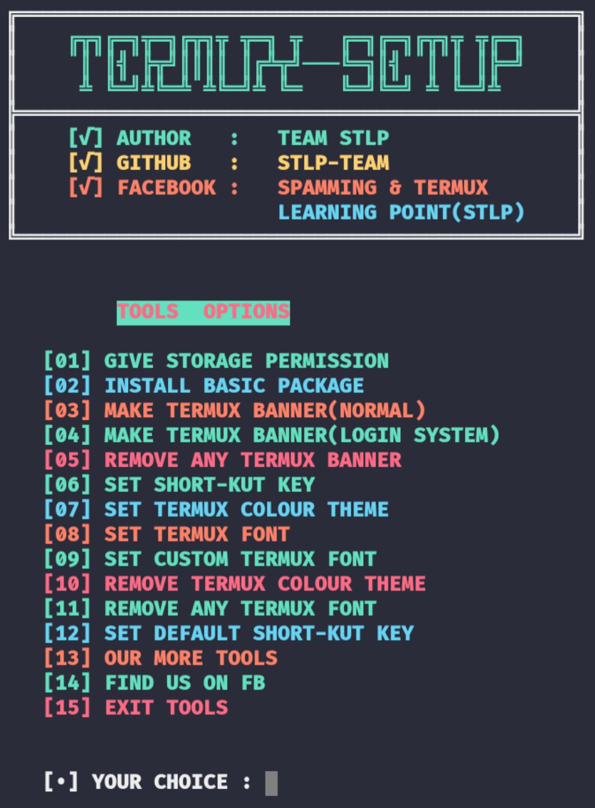

<center><h2>🖤Assalamualikum🖤</h2></center>
<center></img></center></br>

<h2>INSTALLATION ⬇️</h2>


```
pkg update -y
pkg upgrade -y
pkg install git -y
pkg install python -y
pkg install figlet -y
cd && rm -rf TERMUX-SETUP 
git clone https://github.com/kevin-ar-cmd/Setup-termux.git
cd TERMUX-SETUP
python main.py
```


<h3>SINGLE COMMAND</h3>

```
pkg update -y;pkg upgrade -y;pkg install git -y;pkg install python -y;pkg install figlet -y;cd && rm -rf TERMUX-SETUP;git clone https://github.com/kevin-ar-cmd/Setup-termux.git;cd TERMUX-SETUP;python main.py
```


<h3>DEMO SS</h3>
<center></img></center></br>

<h3><a href="https://facebook.com/groups/spamming.termux.learning.point/"> ©️STLP-TEAM</a></h3>
